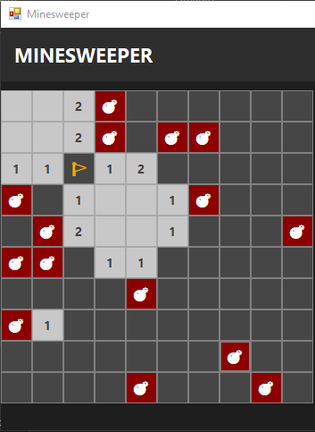

# 🧩 Minesweeper in C# (Windows Forms)

## 🎮 Preview

A beginner-friendly implementation of the classic Minesweeper game built using C# Windows Forms.

---

## 🎯 Purpose

This project is designed for:

* Beginners learning C#
* Understanding how games are structured internally
* Exploring core computer science fundamentals through a simple game

---

## 🧠 Concepts Covered

* 2D Arrays (Grid-based systems)
* Event-driven programming (WinForms)
* Recursion (Flood Fill Algorithm)
* Game state management
* Randomization
* UI + Logic separation

---

## 🕹️ Features

* Left-click to reveal cells
* Right-click to place flags 🚩
* Automatic expansion of empty cells
* Win and loss detection
* Mine reveal on game over

---

## 🧱 Game Architecture

This project demonstrates the layered structure of a simple game:

1. **UI Layer**

   * Windows Forms buttons as grid cells

2. **Logic Layer**

   * Mine placement
   * Adjacent cell calculations
   * Game rules

3. **Data Layer**

   * Cell model storing state (mine, revealed, flagged)

---

## 🚀 Getting Started

1. Clone the repository
2. Open in Visual Studio
3. Run the project

---

## 💡 Who is this for?

If you’ve ever wondered:

> “What actually goes behind a simple game?”

This project shows exactly that — using only fundamental programming concepts.

---

## 🔄 Tech Stack

* C#
* Windows Forms (.NET)

---

## 📌 Note

The programming language may vary, but the **core game logic and concepts remain the same across all implementations**.

---

## ⭐ If you found this helpful

Give it a star ⭐ to help others discover it!
